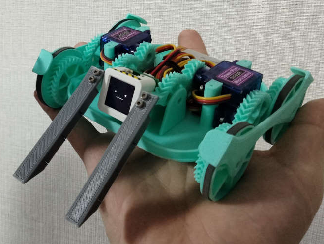

# ミニかわロボとは

「ミニかわロボ」は、本格的な対戦ロボット競技である[かわさきロボット競技大会（かわロボ）](https://kawasaki-sanshinkaikan.jp/robo/)を参考に、**「どこでも気軽にできる手のひらサイズの小型対戦ロボット競技」**をコンセプトに考案された規格です。

3Dプリンタと少しの電子工作知識があれば誰でも安価に製作でき、散らかった机の上でも外出先でも、場所を選ばず熱いバトルを楽しめるのが最大の特徴です。

## コンセプトと背景

従来のロボット競技は、広い練習スペースや高価な部品、高度な機械工作技術が必要なことが多く、初心者にはハードルが高い側面がありました。ミニかわロボは、以下のポイントを重視して設計されています。

- **省スペース**: A3サイズのリングがあれば対戦可能。持ち運びも容易です。
- **低コスト**: 数千円から製作可能。市販のマイクロサーボをメイン動力にします。
- **高自由度**: 3Dプリンタを活用することで、自由な発想のロボットを形にできます。
- **コミュニティ**: 既存のかわロボユーザーだけでなく、電子工作ファンや3Dプリンタユーザーなど、幅広い層の参入を期待しています。

## 基本ルール抜粋

- **サイズ**: 100mm × 150mm以内（スタート時、高さ制限なし）
- **重量**: 150g以下（初心者や単4電池の場合は自己申告で170gまで緩和）
- **動力**: マイクロサーボ（幅12mm程度）
- **勝敗**: 相手をひっくり返して5カウント継続するか、場外に押し出せば勝利。

詳細は[競技ルール](rule.md)をご覧ください。

---

## 詳しい情報・外部リンク

ミニかわロボの設計思想や活動内容について、より詳しく知りたい方は以下の記事もあわせてご覧ください。

### 1. ミニかわロボの提案と初期コンセプト
提案者による最初の提案記事です。なぜこの規格が必要だったのか、どのような課題を解決しようとしているのかが詳しく述べられています。
→ [記事を読む](https://sin1.studio/blog/2023-11-30-234739/)

### 2. 活動報告と今後の展望（2025-2026）
2025年の各地での大会開催レポートや、M5Stackファミリー（ｽﾀｯｸﾁｬﾝ等）との親和性について紹介されています。
→ [記事を読む](https://sin1.studio/blog/2025-12-24-233513/)

### 3. ProtoPedia：詳細な設計データとプロセス
ProtoPediaにはM5Stackコンテスト向けに編集した製作記事を載せています。
> #### [ProtoPedia] ミニかわロボ：手のひらサイズの格闘ロボット
> 
> [→ ProtoPediaで詳細を見る](https://protopedia.net/prototype/5154){: .btn .btn-outline }
{: .note }
