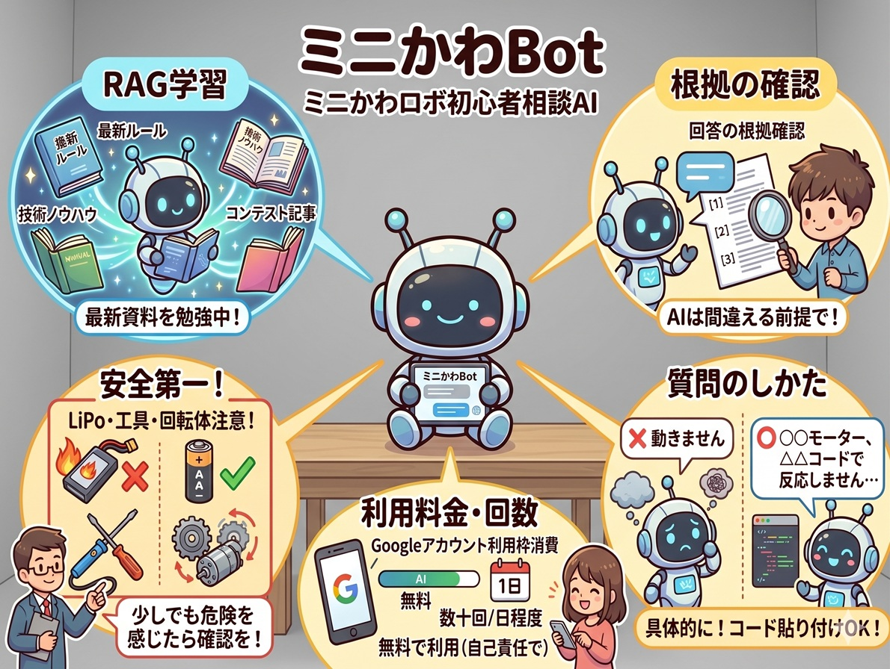

# ミニかわBot

ミニかわBot（ミニかわロボ初心者相談AI）へようこそ！

大会の最新ルールや過去の技術ノウハウを学習(RAG)したAIボットです。
[コンテスト](https://sin1n24.hatenablog.com/entry/2026/05/06/040320)に投稿して頂いた記事や主催者の記事を学習データとして活用しています。

## 回答の根拠（ソース）を確認する

AIはもっともらしく間違った言うことがありますので、その前提でご利用下さい。
回答の最後にある**番号(ソース)**を押すと、元の資料のページを直接確認できます。

## 安全第一で開発しよう

バッテリー(LiPo)の扱いや工具、回転体は火事やケガの危険があります。
バッテリーの取扱いに自信が無い方は乾電池を使って頂いた上で、少しでも危険を感じたら信頼できる人や1次情報を確認して下さい。
免責事項：本ボットの回答を参考にしたことによる事故、ケガ、部品の破損、大会での失格などについて、運営者は一切の責任を負いません。最終的な安全確認やルール適合の判断は必ずご自身で行ってください。

## 上手な質問のしかた

具体的に聞くほど、AIも正確に答えられます。
+ ❌「動きません」
+ ⭕「〇〇のモーターを△△のコードで動かそうとしていますが、反応しません。原因は何ですか？」

わからないコードやエラーメッセージをそのまま貼り付けるのもオススメです！（プログラムについてはまだサンプル数が少なく発展途上です。）

## サービスについて

このボットは無料で使えますが、使う際に質問する人(あなた)のGoogleアカウントのAI利用枠が**消費されます**。
また、ログインや会話の情報は、私（主催者）には情報提供されず学習もされませんので安心してご利用下さい。
無料アカウントの場合、質問できるのは**1日数十回**程度のようです。

## 今後について

作りやすさ、導入しやすさの観点からまずはNotebookLMで作りましたが、プログラム生成能力など課題もありますので、改良やほかのモデルへの変更も検討しています。
広くご意見を募集しておりますので、GitHub IssuesやX(@sin1west)などへご連絡頂ければ幸いです。

---

以上をご理解し**自己責任**で使って頂ける方のみ、以下からご利用頂けます。
[ミニかわBotを利用する (NotebookLM)](https://notebooklm.google.com/notebook/2570853c-8bd8-4135-a3b1-28f1e9fbbb84){: .btn .btn-primary }

