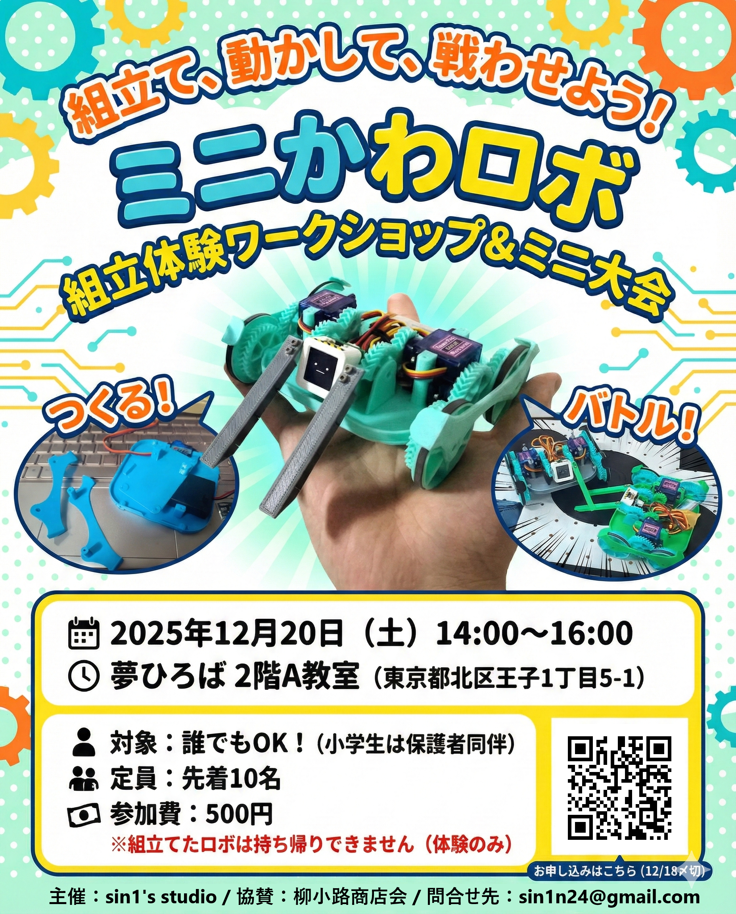

# ミニかわロボ ワークショップ

ミニかわロボは、組立てから操縦、そして対戦までを体験できるワークショップを定期的に開催しています。ロボット製作の楽しさを気軽に体験できる機会を提供しています。

1. TOC
{:toc}

---

## 過去の開催実績

### 組立体験ワークショップ＆ミニ大会 in 王子 (2025年12月20日)

2025年12月20日（土）に、東京都北区王子にて組立体験ワークショップとミニ大会を開催しました。

参加者の皆様には、ミニかわロボの組立から操縦、そして熱いバトルまでを一通り体験していただきました。

| 項目 | 内容 |
| :--- | :--- |
| **開催日時** | 2025年12月20日（土）14:00〜16:00 |
| **開催場所** | 夢ひろば 2階A教室 (東京都北区王子1丁目5-1) |
| **対象** | 誰でもOK！ (小学生は保護者同伴) |
| **定員** | 先着10名 |
| **参加費** | 500円 |
| **備考** | 組立てたロボは持ち帰りできません（体験のみ） |

---

## ワークショップの流れ

ミニかわロボのワークショップでは、以下の3つのステップを通じて、ロボット製作と対戦の楽しさを体験できます。

### 1. つくる！ (組立体験)

3Dプリンタで出力されたパーツを使い、ミニかわロボを組み立てます。専門のスタッフが丁寧にサポートしますので、初心者の方でも安心してご参加いただけます。ロボットの構造や電子部品の接続について学びながら、自分だけのロボットを形にしていきます。

### 2. 動かす！ (操縦体験)

組み立てたロボットを実際に動かしてみます。コントローラーを使ってロボットを自由に操縦し、その動きを体感します。プログラムは標準のものを使うのでスキルは不要です。

### 3. バトル！ (ミニ大会)

操縦に慣れてきたら、参加者同士でミニ大会を開催します。自作のロボットをリング上で戦わせ、その性能と操縦スキルを競い合います。白熱したバトルを通じて、ロボット競技の醍醐味を味わうことができます。

---

## 今後のワークショップ開催について

現在、**秋葉原**でのワークショップ開催を検討しております。より多くの方にミニかわロボの楽しさを体験していただくため、皆様からのご意見やリクエストを募集しています。

- **開催時期**: どの季節や時期が参加しやすいですか？
- **ワークショップ内容**: どのような内容（組立、プログラミング、対戦など）に興味がありますか？
- **場所**: 秋葉原周辺で希望する会場や施設はありますか？
- **その他**: 参加費、時間帯、対象年齢など、ご意見をお聞かせください。

ご意見・リクエストは、[GitHub Issues](https://github.com/sin1n24/MiniKawaRobo/issues)または[公式SNS](https://x.com/sin1west)までお気軽にお寄せください。皆様からの貴重なご意見を参考に、より良いワークショップを企画してまいります。
