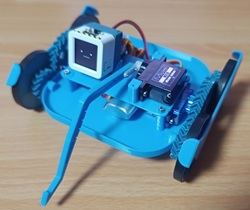
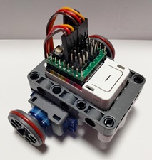

# 製作例の紹介

ミニかわロボの製作例を紹介します。公式のキットや設計データを使用した例から、ユーザーによる独創的なカスタマイズまで、幅広く掲載しています。

1. TOC
{:toc}

---

## ミニレパード

**ダブルヘリカルギア（やまば歯車）**がチャームポイントの、実戦的なロボットです。複雑なギア機構を3Dプリンタで出力し、小型ながら力強い動きを実現しています。

- **制御**: [AtomS3](https://ssci.to/8670) + [4サーボ接続基板キット](https://ssci.to/11122)
- **動力**: 360°サーボ x2（移動用）、180°サーボ x1（アーム用）
- **特徴**: 3Dプリントされたフレームに、ダブルヘリカルギアを搭載。
- **リソース**: [ロボット用のプログラム](https://sin1n24.hatenablog.com/entry/2025/10/18/231400)

## ミニカプセルロボ

市販のパーツを組み合わせるだけで、とりあえず動作させることができる**お手軽なロボット**です。体当たりが主な攻撃手段ですが、初めての一台として最適です。

- **制御**: [M5Capsule](https://ssci.to/9272) + [5サーボ接続基板キット](https://ssci.to/11121)
- **動力**: [Servo Kit 360'](https://ssci.to/6479)
- **特徴**: M5Capsuleの内蔵バッテリーを活用し、配線を極限までシンプルにしています。
- **リソース**: [ロボット用のプログラム](https://sin1n24.hatenablog.com/entry/2025/10/18/231400)

---

## みんなの製作例

ユーザーの皆様による、独創的なミニかわロボの製作例をご紹介します。

### 1. 初心者向けM5シリーズ活用ガイド
M5Atom S3やM5Capsuleを使用した、初心者でも作りやすい構成例を紹介しています。スマホアプリでの操縦方法も詳しく解説されており、最初の一歩に最適です。
<iframe class="note-embed" src="https://note.com/embed/notes/n0a02cd8ad297" style="border: 0; display: block; max-width: 99%; width: 494px; padding: 0px; margin: 10px 0px; position: static; visibility: visible;" height="400"></iframe>

### 2. M5ATOMを用いた詳細な制御コード例
より高度な制御を目指す方向けに、M5Atomを使用した詳細なプログラミング例と機体構成が紹介されています。カスタムコントローラの実装など、中級者以上のステップアップに役立ちます。
<iframe class="note-embed" src="https://note.com/embed/notes/nb0adce424a60" style="border: 0; display: block; max-width: 99%; width: 494px; padding: 0px; margin: 10px 0px; position: static; visibility: visible;" height="400"></iframe>

---

## 製作例の投稿について
現在、公式サイトへの投稿フォームを準備中です。ご自身の製作したロボットを掲載希望の方は、SNS（X/Twitter）でハッシュタグ **#ミニかわロボ** を付けて投稿いただくか、[GitHub Issues](https://github.com/sin1n24/MiniKawaRobo/issues)でご紹介ください！
