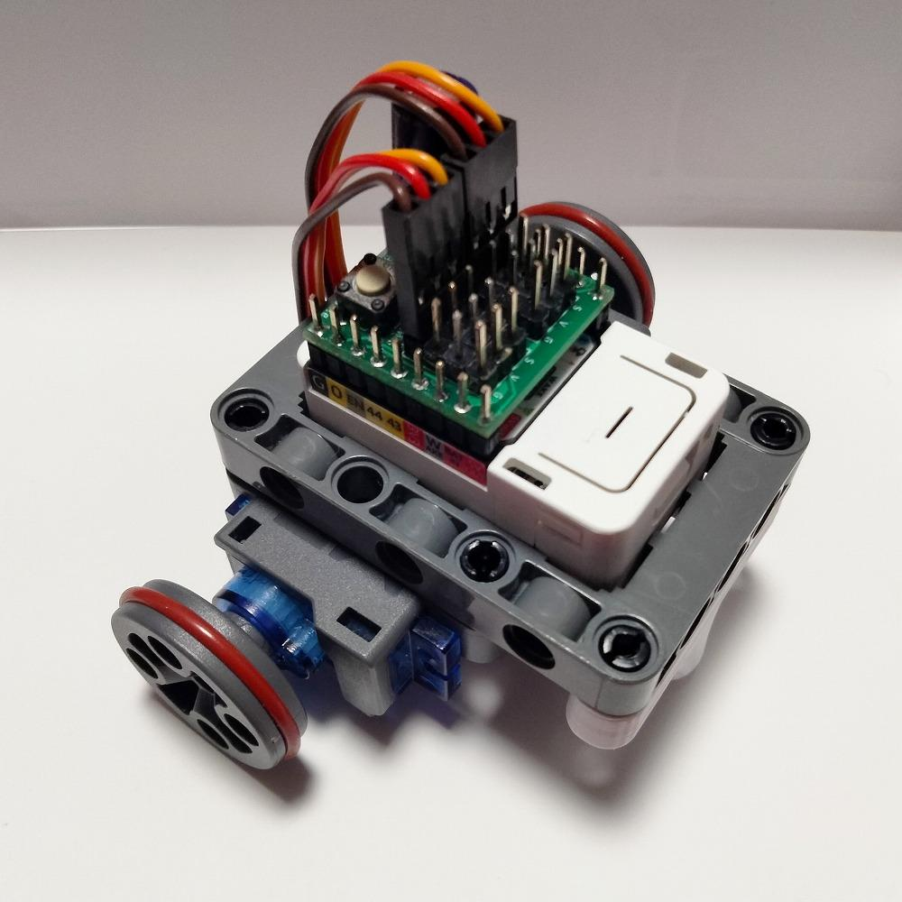

**目次**
* TOC
{:toc}

## ミニレパード

ダブルヘリカルギアがチャームポイントのちゃんと戦えるロボット。
+ [AtomS3](https://ssci.to/8670)
+ [4サーボ接続基板キット](https://ssci.to/11122)
+ 360サーボ x2
+ 180サーボ x1
+ 3Dプリントしたフレーム ※販売に向けて改良中
+ M2ねじ長さ6 x14
+ 単4乾電池 x3
+ 乾電池ケース
+ [ロボット用のプログラム](https://sin1n24.hatenablog.com/entry/2025/10/18/231400)
+ 操縦用のスマホ or [コントローラ](https://ssci.to/9520)

## ミニカプセルロボ

販売品のみで取敢えず動作するお手軽ロボット。体当たりしかできない。
+ [M5Capsule](https://ssci.to/9272)
+ [Servo Kit 360'](https://ssci.to/6479)
+ [5サーボ接続基板キット](https://ssci.to/11121)
+ [ロボット用のプログラム](https://sin1n24.hatenablog.com/entry/2025/10/18/231400)
+ 操縦用のスマホ or [コントローラ](https://ssci.to/9520)

## みんなの製作例
今後投稿フォームを作成予定ですが、ひとまず紹介まで。

<iframe class="note-embed" src="https://note.com/embed/notes/n0a02cd8ad297" style="border: 0; display: block; max-width: 99%; width: 494px; padding: 0px; margin: 10px 0px; position: static; visibility: visible;" height="400"></iframe>

<iframe class="note-embed" src="https://note.com/embed/notes/nb0adce424a60" style="border: 0; display: block; max-width: 99%; width: 494px; padding: 0px; margin: 10px 0px; position: static; visibility: visible;" height="400"></iframe>
