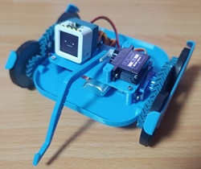

#ミニレパードの場合

+ [AtomS3](https://ssci.to/8670)
+ [4サーボ接続基板](https://ssci.to/9474)
+ 360サーボ x2
+ 180サーボ x1
+ フレーム ※公開予定
+ M2ねじ長さ6 x14
+ 単4乾電池 x3
+ 乾電池ケース
+ 操縦用のスマホ or [コントローラ](https://ssci.to/9520)

#ミニカプセルロボの場合

+ [M5Capsule](https://ssci.to/9272)
+ [Servo Kit 360'](https://ssci.to/6479)
+ [5サーボ接続基板](https://ssci.to/9475)
+ ピンヘッダ
+ 電解コンデンサ
+ [キャスターやフレームなど](https://makerworld.com/en/models/795780-mini-kawa-robot)
+ 操縦用のスマホ or [コントローラ](https://ssci.to/9520)

